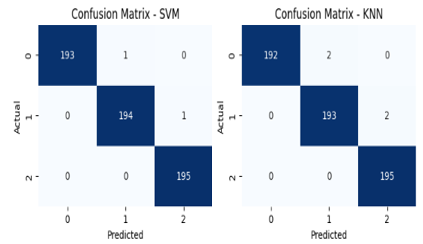
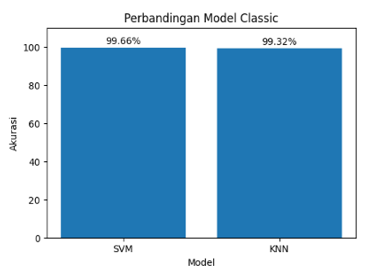

# Model Evaluation

Tahap evaluasi dilakukan untuk menilai kinerja
model klasifikasi sentimen yang telah dilatih.
Evaluasi ini bertujuan untuk mengetahui
sejauh mana model mampu mengklasifikasikan data secara akurat
serta mengukur dampak penerapan metode SMOTE.

---

## Evaluation Metrics

Metode evaluasi yang digunakan dalam penelitian ini meliputi:
- Confusion Matrix
- Accuracy
- Precision
- Recall
- F1-score

Metrik tersebut dipilih karena mampu memberikan gambaran
yang komprehensif terhadap performa model klasifikasi,
terutama pada dataset dengan distribusi kelas yang tidak seimbang.

---

## Confusion Matrix

### Support Vector Machine (SVM)

Gambar berikut menunjukkan confusion matrix
hasil klasifikasi menggunakan model SVM
pada data yang telah melalui proses oversampling SMOTE.

Hasil confusion matrix menunjukkan bahwa
model SVM mampu mengklasifikasikan setiap kelas sentimen
dengan tingkat kesalahan yang relatif rendah
dan performa yang stabil pada seluruh kelas.

---

### K-Nearest Neighbor (K-NN)

Berikut merupakan confusion matrix
hasil klasifikasi menggunakan model K-NN.

 

Model K-NN menunjukkan performa yang cukup baik,
namun masih terdapat kesalahan klasifikasi
pada beberapa kelas sentimen tertentu,
terutama pada kelas minoritas.

---

## Performance Comparison

 

Berdasarkan hasil evaluasi:
- Model **SVM** menghasilkan nilai akurasi dan F1-score
  yang lebih tinggi dibandingkan K-NN.
- Model **K-NN** cenderung lebih sensitif
  terhadap perubahan distribusi data,
  meskipun telah diterapkan SMOTE.
- Penerapan SMOTE membantu kedua model
  dalam mengenali kelas minoritas dengan lebih baik.

Secara keseluruhan, SVM memberikan performa
yang lebih konsisten dan optimal
dibandingkan K-NN dalam penelitian ini.

---

## Evaluation Insight

Beberapa insight penting yang diperoleh:
- Confusion matrix menunjukkan bahwa
  SMOTE berhasil mengurangi bias model
  terhadap kelas mayoritas.
- Evaluasi berbasis F1-score lebih representatif
  dibandingkan akurasi semata
  pada kasus data tidak seimbang.
- Pemilihan algoritma klasifikasi
  memiliki pengaruh signifikan terhadap hasil akhir.

---

## Conclusion

Berdasarkan hasil evaluasi,
dapat disimpulkan bahwa penerapan SMOTE
memberikan kontribusi positif terhadap performa model klasifikasi.

Model Support Vector Machine (SVM)
menunjukkan kinerja terbaik dan paling stabil,
sehingga lebih direkomendasikan
untuk analisis sentimen pada data
dengan ketidakseimbangan kelas.
