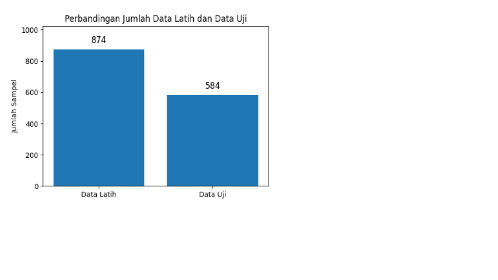

# Modeling

Tahap modeling bertujuan untuk membangun model klasifikasi sentimen
berdasarkan data yang telah melalui proses preprocessing dan pelabelan
sentimen otomatis.

Fokus utama pada tahap ini adalah penanganan ketidakseimbangan kelas
(class imbalance) menggunakan metode **Synthetic Minority Over-sampling
Technique (SMOTE)** sebelum proses pelatihan model.

Model yang digunakan dalam penelitian ini meliputi:
- Support Vector Machine (SVM)
- K-Nearest Neighbor (K-NN)

---

## Permasalahan Class Imbalance

Distribusi kelas sentimen pada data awal tidak seimbang,
di mana kelas mayoritas mendominasi dataset.
Kondisi ini dapat menyebabkan model bias dan menurunkan
kemampuan dalam mengenali kelas minoritas.

Untuk mengatasi permasalahan tersebut,
diterapkan metode oversampling SMOTE.

---

## Penerapan SMOTE

SMOTE digunakan untuk menghasilkan sampel sintetis
pada kelas minoritas sehingga distribusi kelas menjadi lebih seimbang.


```python
from imblearn.over_sampling import SMOTE

smote = SMOTE(random_state=42)
X_resampled, y_resampled = smote.fit_resample(X, y)
```
## Pembagian Data Training dan Testing
 
```python
# Import libraries
from sklearn.model_selection import train_test_split
from imblearn.over_sampling import SMOTE
from sklearn.preprocessing import StandardScaler, LabelEncoder
import pandas as pd
import numpy as np

# Load dataset
file_path = 'labeling_vader.csv'
try:
    data = pd.read_csv(file_path, sep=',', on_bad_lines='warn', encoding='latin1')
except UnicodeDecodeError:
    data = pd.read_csv(file_path, sep=',', on_bad_lines='warn', encoding='utf-8')

# Drop missing values and make a copy to avoid SettingWithCopyWarning
cleaned_data = data.dropna(subset=['Sentiment', 'Positive', 'Negative', 'Neutral', 'Compound']).copy()

# Convert string numbers with commas to floats
cols_to_convert = ['Positive', 'Negative', 'Neutral', 'Compound']
for col in cols_to_convert:
    cleaned_data[col] = (
        cleaned_data[col]
        .astype(str)
        .str.replace(',', '.', regex=False)
        .astype(float)
    )

# Feature matrix and target vector
X = cleaned_data[cols_to_convert]
y = cleaned_data['Sentiment']

# Feature scaling
scaler = StandardScaler()
X_scaled = scaler.fit_transform(X)

# Encode categorical target labels
label_encoder = LabelEncoder()
y_encoded = label_encoder.fit_transform(y)

# Handle class imbalance with SMOTE
smote = SMOTE(random_state=42)
X_resampled, y_resampled = smote.fit_resample(X_scaled, y_encoded)

# Train-test split
X_train, X_test, y_train, y_test = train_test_split(
    X_resampled, y_resampled, test_size=0.4, random_state=42, stratify=y_resampled
)

# Print dataset info
print("Jumlah data latih:", len(X_train))
print("Jumlah data uji:", len(X_test))
print("=========================")

# Print shape of training and testing data
print(X_train.shape, X_test.shape)
```

## Pemodelan Machine Learning (SVM - KNN)
```python
from sklearn.svm import SVC #SVM
from sklearn.neighbors import KNeighborsClassifier  # KNN
from sklearn.metrics import accuracy_score

# Define models
models = {
    "SVM": SVC(kernel='linear', probability=True, C=1),
    "KNN": KNeighborsClassifier(n_neighbors=5),
}

# Train dan Evaluasi models
results = {}
predictions = {}
for model_name, model in models.items():
    model.fit(X_train, y_train) #Latih model dengan data Latih
    y_pred = model.predict(X_test) #Prediksi data uji
    y_proba = model.predict_proba(X_train) if hasattr(model, "predict_proba") else None  # Use X_train for training predictions
    predictions[model_name] = y_proba
    results[model_name] = {
        'accuracy': accuracy_score(y_test, y_pred), #Hitung antara label prediksi vs label asli
        'y_pred': y_pred
    }
    print(f"{model_name} Accuracy: {results[model_name]['accuracy']:.4f}")
```
