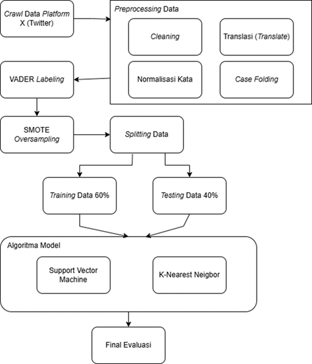

# Research Pipeline

Dokumen ini menjelaskan alur penelitian secara menyeluruh,
mulai dari pengumpulan data hingga evaluasi model klasifikasi sentimen.

Pipeline ini dirancang untuk memastikan setiap tahapan
dilakukan secara sistematis dan terstruktur.

---

## 1. Data Collection

Data dikumpulkan dari media sosial Twitter
berdasarkan kata kunci yang relevan dengan topik penelitian.

Data yang diperoleh bersifat tidak terstruktur
dan mengandung berbagai noise seperti URL, emoji, dan bahasa informal.

---

## 2. Data Preprocessing

Tahap preprocessing bertujuan untuk membersihkan dan menyiapkan data
agar siap digunakan dalam proses analisis.

Tahapan preprocessing meliputi:
- Cleaning data (URL, emoji, simbol, angka, username)
- Case folding
- Normalisasi kata formal dan informal
- Translasi teks ke Bahasa Inggris
- Pelabelan sentimen otomatis menggunakan VADER

---

## 3. Feature Preparation

Data yang telah dipreprocessing diubah ke dalam bentuk numerik
yang dapat diproses oleh algoritma machine learning.

Tahap ini memastikan format data
sesuai dengan kebutuhan model klasifikasi.

---

## 4. Handling Class Imbalance

Distribusi kelas sentimen yang tidak seimbang
ditangani menggunakan metode oversampling **SMOTE**.

Tahap ini bertujuan untuk:
- Mengurangi bias model terhadap kelas mayoritas
- Meningkatkan kemampuan model mengenali kelas minoritas

---

## 5. Model Training

Data hasil oversampling digunakan untuk melatih model klasifikasi.

Model yang digunakan:
- Support Vector Machine (SVM)
- K-Nearest Neighbor (K-NN)

Setiap model dilatih secara terpisah
untuk membandingkan performa klasifikasi.

---

## 6. Model Evaluation

Model dievaluasi menggunakan metrik klasifikasi, meliputi:
- Confusion Matrix
- Accuracy
- Precision
- Recall
- F1-score

Hasil evaluasi digunakan untuk menentukan
model dengan performa terbaik.

---

## 7. Conclusion

Tahap akhir berupa analisis hasil eksperimen
dan penarikan kesimpulan berdasarkan performa model.

Kesimpulan ini menjadi dasar
untuk rekomendasi pengembangan penelitian selanjutnya.
